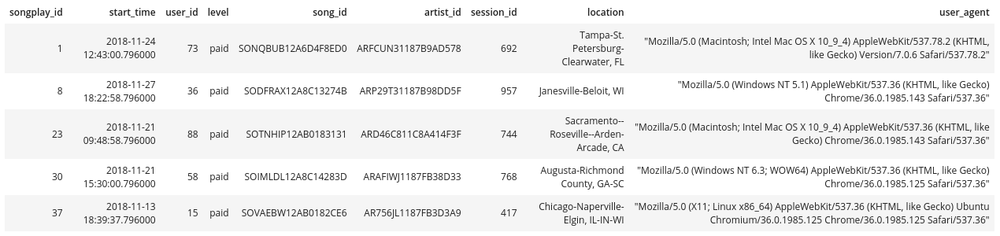

# Data Warehouse

## Introduction
> #### This project build an ETL pipeline in AWS cloud for a fictitious music streaming company: Sparkify. There are two datasets storaged in AWS S3 bucket. The first dataset is a log data in JSON format that gives logs on user activity on the app, as well as a directory with JSON metadata on the songs in their app.The main goal of this project is extracts the data from S3, stages them in Redshift, and transforms data into a set of dimensional tables . Dimensional tables  allow to easy way to finding insights in what songs their users are listening to. 


## Datasets description

### **Song Dataset**

The first dataset is a subset of real data from the [Million Song Dataset](url:http://millionsongdataset.com/). Each file is in JSON format and contains metadata about a song and the artist of that song. The files are partitioned by the first three letters of each song's track ID. For example, here are filepaths to two files in this dataset.

```
song_data/A/B/C/TRABCEI128F424C983.json
song_data/A/A/B/TRAABJL12903CDCF1A.json
```
And below is an example of what a single song file, TRAABJL12903CDCF1A.json, looks like.
```
{"num_songs": 1, "artist_id": "ARJIE2Y1187B994AB7", "artist_latitude": null, "artist_longitude": null, "artist_location": "", "artist_name": "Line Renaud", "song_id": "SOUPIRU12A6D4FA1E1", "title": "Der Kleine Dompfaff", "duration": 152.92036, "year": 0}
```
### **Log Dataset**
The second dataset consists of log files in JSON format generated by this event simulator based on the songs in the dataset above. These simulate app activity logs from an imaginary music streaming app based on configuration settings.

The log files in the dataset you'll be working with are partitioned by year and month. For example, here are filepaths to two files in this dataset.
```
log_data/2018/11/2018-11-12-events.json
log_data/2018/11/2018-11-13-events.json
```

And below is an example of what the data in a log file, 2018-11-12-events.json, looks like.


## Dimension Tables
*`users`* table features: user_id, first_name, last_name, gender, level


*`songs`* table features: song_id, title, artist_id, year, duration


*`artists`* table features: artist_id, name, location, latitude, longitude


*`time`* table features: start_time, hour, day, week, month, year, weekday


## Fact Table
*`songplays`* table features: songplay_id, start_time, user_d, level, song_id, artist_id, session_id, location, user_agent, see image below:




## Pipeline description

The `etl.py` implements the `class ETLPipeline`, this class has two methods:
- `_load_staging_tables` which creates `UPSERTs` (an `INSERT` that converts itself into an update if a row already exists with the provided primary key). To perform `UPSERTs` on Redshift, we use staging tables.
- `insert_tables` which in fact make the insertions into tables.


## Usage
To build the ETL:
- run `python create_tables.py` to reset/create tables.
- create connection and cluster with `make_connection_cluster.ipynb`
- run `etl.py` to perform `UPSERTs` and `INSERTs`.
- to see the results, back in the `make_connection_cluster.ipynb`, section `Cheking Results` and run all cells to delete the cluster, IAM in AWS. 


## References
- http://www.silota.com/blog/amazon-redshift-upsert-support-staging-table-replace-rows/
- https://docs.aws.amazon.com/redshift/latest/dg/r_CREATE_TABLE_NEW.html
- https://www.postgresql.org/docs/10/functions-formatting.html
