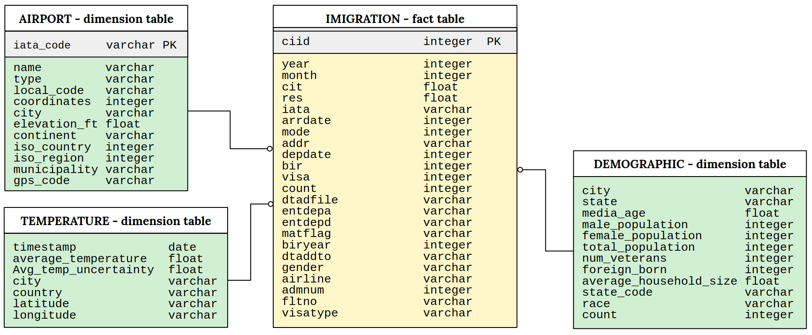

# CapstoneProject
---
The aim of this project is to create a data analysis solution that provides insights and possibly improvements to the process and customer experiences of the US Customs system. This solution is achieved through data engineering techniques with scalable tools to the modeling process. 

# Data sources
---

- I94 Immigration Data: This data comes from the US National Tourism and Trade Office with the official monthly and annual overseas visitor arrivals to the United States, [source](https://travel.trade.gov/research/programs/i94/index.asp).

- Airport Code Data: This is a simple table of airport codes and corresponding cities. The airport codes may refer to either IATA airport code, a three-letter code which is used in passenger reservation, ticketing and baggage-handling systems, [source](https://datahub.io/core/airport-codes#data).

- U.S. City Demographic Data: This dataset contains information about the demographics of all US cities and census-designated places with a population greater or equal to 65,000. This data comes from the US Census Bureau's 2015 American Community Survey, [source](https://public.opendatasoft.com/explore/dataset/us-cities-demographics/export/).

- World Temperature Data: The raw data comes from [here](http://berkeleyearth.org/data/) and we use the data from [Kaggle](https://www.kaggle.com/berkeleyearth/climate-change-earth-surface-temperature-data). This data provides climate change by city with records starting in 1750.

# ETL
---

The Exploration Data Analysis (EDA) and Extract Transform Load (ETL) were performed using two open source technologies:
Spark and PostGres, such tools were chosen because they are versatile and scalable when the data really becomes big.

> 0 - **Exploration Data Analysis:** 

We perform EDA in the four datasets for understanding the type of data we are dealing with.

The entire pipeline is contained in the script  `etl.py` it has the following steps:

> 1-  **Cleaning steps:** 

We cleaning the datasets and removing missing values, with spark. 

> 2-  **Create tables:** 

We create dimension and fact tables, in our design the dimension tables are _airports_, _demographics_ and _temperature_ and the fact 
table is the _immigration_, the figure Fig(1) shown these tables. The _airports_ dimension table was created by a join of the city with airports data.

> 3-  **Data insertion:** 

We performe the insertion data with PostGres.

> 4- **Data quality checks:** 

We guarantee that the data insertion is correct with quality insertion checks. A small sample of each table is shown after the insertion in this notebook.

> 5- **Project Write Up and Conclusion:** 

We justify our project design choices and ensure that the project is scalable with minor changes

# Conceptual Data Model
---

# What would I do if...

- Justification for choosing tools and technologies for the project: 

We use Apache Spark becuase this tool has great flexibility to handle with multiple file formats and large amounts of data. Spark also has several APIs that are easy to use. We also use PostGres, which is a secure database server, just like spark, PostGres is a open source project and implements SQL language syntax. It is versatile, PostGres can runs on Unix, Mac OS X, Solaris and Windows systems. PostgreS supports considerable workloads and is able to process large volumes of data.

- How often the data should be updated and why?

The current I94 immigration data is updated monthly and therefore the data will be updated monthly.

- What is the strategy if the data increases 100x?

The Spark is still appropriate for theis situation, however will be necessary to increase the number of nodes in the cluster. If the data become big in storage we can use Amazon S3.

- What would you do if the data needed to be updated daily at 7 am?

You must use Apache Airflow to schedule and run data pipelines.

- What would you do if the data needed to be accessed by 100 different people?

The solution indicated for this situation is to move the analytical database to Amazon Redshift.